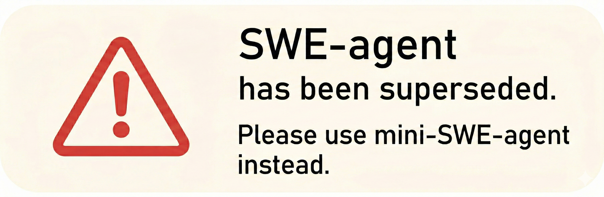
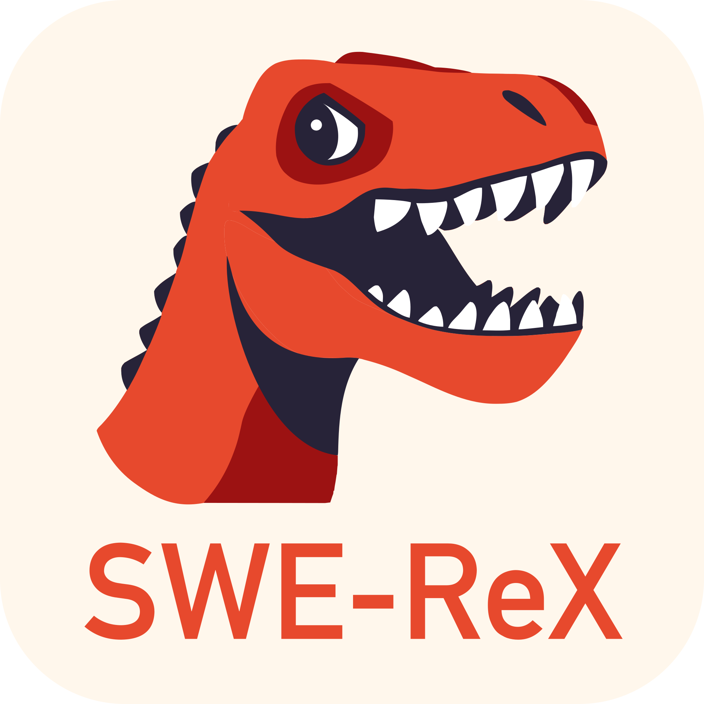
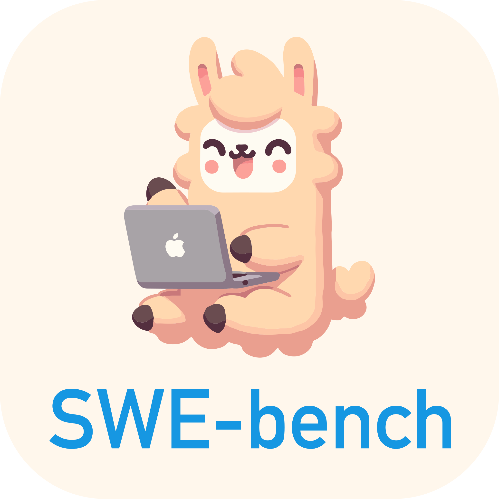
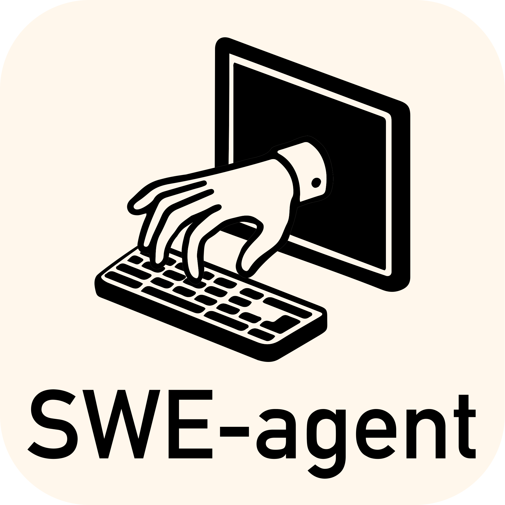
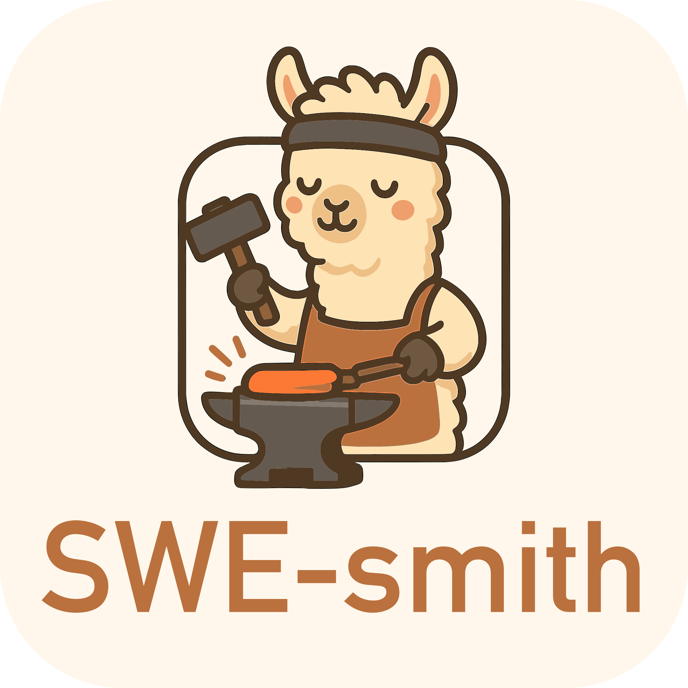
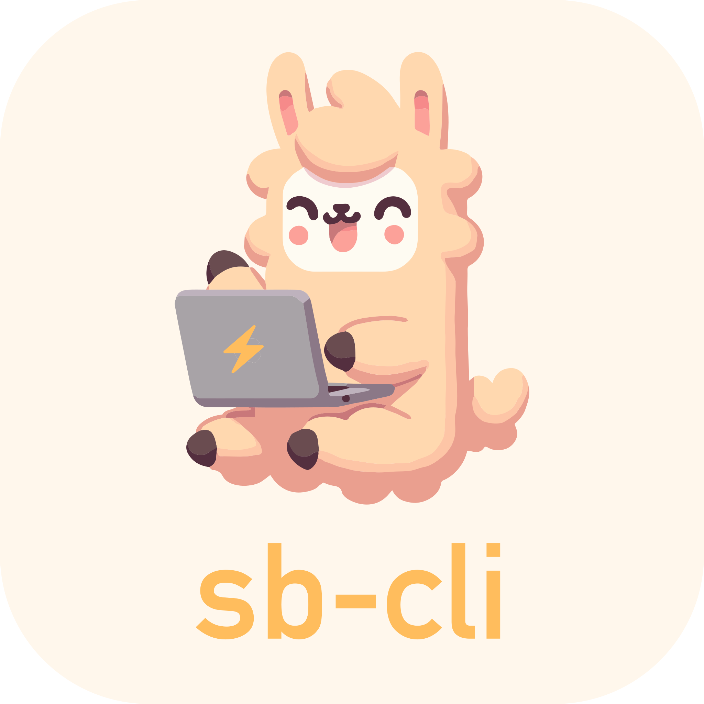

<p align="center">
  <a href="https://github.com/shaoshao66/code-fixer/latest/">
    
  </a>
</p>

<p align="center">
<a href="https://github.com/shaoshao66/code-fixer/latest/"></a>
<a href="https://swe-bench.slack.com"></a>
<a href="https://arxiv.org/abs/2405.15793"></a>
</p>

<p align="center">
  <a href="https://github.com/SWE-agent/mini-swe-agent/">
    
  </a>
</p>

> [!warning]
> 我们目前的大部分开发精力都集中在 [mini-swe-agent](https://github.com/SWE-agent/mini-swe-agent/) 上，它已经取代了 Code-Fixer。mini-swe-agent 在性能上与 Code-Fixer 相当，但实现要简单得多。
> 有关两者差异的更多细节，请参见 [FAQ](https://mini-swe-agent.com/latest/faq/)。
> 我们的一般建议是：今后请优先使用 mini-swe-agent，而不是 Code-Fixer。


Code-Fixer 让您所选择的语言模型（例如 GPT-4o 或 Claude Sonnet 4）能够自主地使用工具来[修复真实 GitHub 仓库中的问题](https://github.com/shaoshao66/code-fixer/latest/usage/hello_world)、[发现网络安全漏洞](https://enigma-agent.com/)，或者[执行任何自定义任务](https://github.com/shaoshao66/code-fixer/latest/usage/coding_challenges)。

* ✅ **当前最先进水平**：在开源项目中于 SWE-bench 上取得领先成绩
* ✅ **自由灵活且通用**：赋予语言模型最大的自主权
* ✅ **可配置且文档完备**：只需一个 `yaml` 文件即可控制
* ✅ **为研究而设计**：简单且易于二次开发

Code-Fixer 由普林斯顿大学和斯坦福大学的研究者构建与维护。

## 📣 新闻

* 7月24日：[Mini-SWE-Agent](https://github.com/SWE-agent/mini-swe-agent) 仅用 100 行 Python 就在 SWE-bench verified 上达到了 65%！
* 5月2日：[Code-Fixer-LM-32b](https://github.com/SWE-bench/SWE-smith) 在 SWE-bench 上取得了开源权重的最先进水平（SoTA）
* 2月28日：[Code-Fixer 1.0 + Claude 3.7 在 SWE-Bench full 上达到 SoTA](https://x.com/KLieret/status/1895487966409298067)
* 2月25日：[Code-Fixer 1.0 + Claude 3.7 在 SWE-bench verified 上达到 SoTA](https://x.com/KLieret/status/1894408819670733158)
* 2月13日：[发布 Code-Fixer 1.0：在 SWE-bench light 上达到 SoTA，并带来大量新特性](https://x.com/KLieret/status/1890048205448220849)
* 12月7日：[Code-Fixer 与 SWE-bench 团队访谈](https://www.youtube.com/watch?v=fcr8WzeEXyk)

## 🚀 快速开始！

👉 在浏览器中试用 Code-Fixer：[](https://codespaces.new/shaoshao66/code-fixer) ([更多信息](https://github.com/shaoshao66/code-fixer/latest/installation/codespaces/))

请阅读我们的[文档][docs]以了解更多：

* [安装](https://github.com/shaoshao66/code-fixer/latest/installation/source/)
* [命令行 Hello world](https://github.com/shaoshao66/code-fixer/latest/usage/hello_world/)
* [在 SWE-bench 上进行基准测试](https://github.com/shaoshao66/code-fixer/latest/usage/batch_mode/)
* [常见问题解答](https://github.com/shaoshao66/code-fixer/latest/faq/)

[docs]: https://github.com/shaoshao66/code-fixer

## Code-Fixer 用于进攻性网络安全（EnIGMA） <a name="enigma"></a>

</img>

[Code-Fixer: EnIGMA][enigma] 是一个用于解决进攻性网络安全（夺旗赛 CTF）挑战的模式。EnIGMA 在多个网络安全基准上取得了领先成绩（参见[排行榜](https://enigma-agent.com/#results)）。在我们为 1.0 版本更新 EnIGMA 期间，请先使用 [Code-Fixer 0.7](https://github.com/shaoshao66/code-fixer/tree/v0.7)。

[enigma]: https://enigma-agent.com
[SWE-bench]: https://github.com/SWE-bench/SWE-bench
[nyu-ctf]: https://arxiv.org/abs/2406.05590

此外，您可能对我们的其他项目也感兴趣：


<div align="center">
  <a href="https://github.com/SWE-agent/mini-SWE-agent"></a>
   &nbsp;&nbsp;
  <a href="https://github.com/SWE-agent/SWE-ReX"></a>
   &nbsp;&nbsp;
  <a href="https://github.com/SWE-bench/SWE-bench"></a>
  &nbsp;&nbsp;
  <!-- <a href="https://github.com/shaoshao66/code-fixer"></a> -->
  <a href="https://github.com/SWE-bench/SWE-smith"></a>
  &nbsp;&nbsp;
  <a href="https://github.com/SWE-bench/sb-cli"></a>
</div>

## 贡献 <a name="contributions"></a>

如果您想为代码库做出贡献，我们欢迎[提交 issue](https://github.com/shaoshao66/code-fixer/issues) 和 [Pull Request](https://github.com/shaoshao66/code-fixer/pulls)！对于较大的代码改动，我们始终鼓励先在 issue 中进行讨论。

## 引用与联系方式 <a name="citation"></a>

Code-Fixer 是始于普林斯顿大学的学术项目，作者包括 John Yang*、Carlos E. Jimenez*、Alexander Wettig、Kilian Lieret、Shunyu Yao、Karthik Narasimhan 和 Ofir Press。
联系人：[John Yang](https://john-b-yang.github.io/)、[Carlos E. Jimenez](http://www.carlosejimenez.com/) 和 [Kilian Lieret](https://www.lieret.net/)（邮箱：johnby@stanford.edu、carlosej@cs.princeton.edu、kl5675@princeton.edu）。

如果您觉得这项工作有帮助，请考虑按以下方式引用：

<details>
<summary> Code-Fixer 引用</summary>

```bibtex
@inproceedings{yang2024codefixer,
  title={{SWE}-agent: Agent-Computer Interfaces Enable Automated Software Engineering},
  author={John Yang and Carlos E Jimenez and Alexander Wettig and Kilian Lieret and Shunyu Yao and Karthik R Narasimhan and Ofir Press},
  booktitle={The Thirty-eighth Annual Conference on Neural Information Processing Systems},
  year={2024},
  url={https://arxiv.org/abs/2405.15793}
}
```
</details>

如果您使用了 Code-Fixer 中的摘要器（summarizer）、交互式命令或进攻性网络安全功能，还请考虑引用：

<details>
<summary>EnIGMA 引用</summary>

```bibtex
@misc{abramovich2024enigmaenhancedinteractivegenerative,
      title={EnIGMA: Enhanced Interactive Generative Model Agent for CTF Challenges},
      author={Talor Abramovich and Meet Udeshi and Minghao Shao and Kilian Lieret and Haoran Xi and Kimberly Milner and Sofija Jancheska and John Yang and Carlos E. Jimenez and Farshad Khorrami and Prashanth Krishnamurthy and Brendan Dolan-Gavitt and Muhammad Shafique and Karthik Narasimhan and Ramesh Karri and Ofir Press},
      year={2024},
      eprint={2409.16165},
      archivePrefix={arXiv},
      primaryClass={cs.AI},
      url={https://arxiv.org/abs/2409.16165},
}
```
</details>


## 🪪 许可证 <a name="license"></a>
MIT。请查看 `LICENSE`。


<div align="center">

[](https://github.com/shaoshao66/code-fixer/actions/workflows/pytest.yaml)
[](https://github.com/shaoshao66/code-fixer/actions/workflows/build-docs.yaml)
[](https://codecov.io/gh/shaoshao66/code-fixer)
[](https://github.com/shaoshao66/code-fixer/actions/workflows/check-links-periodic.yaml)

</div>