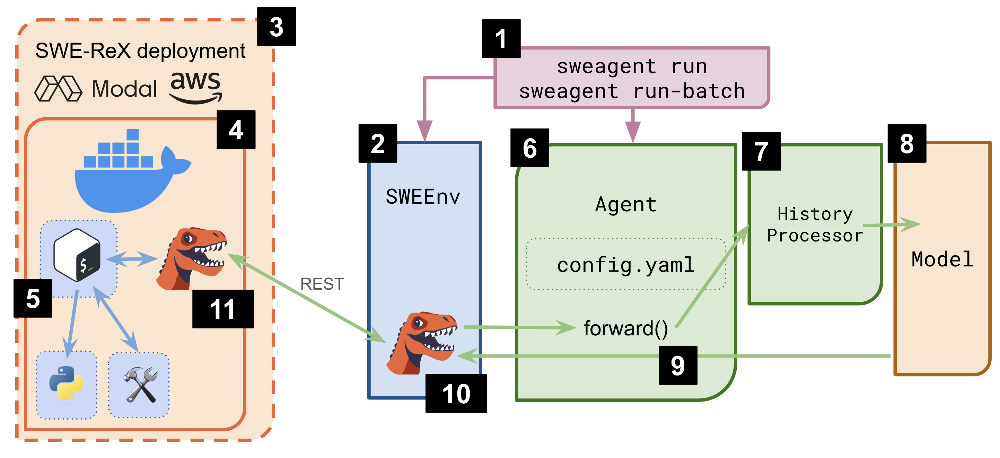

# 架构

本页将带你了解 Code-Fixer 软件包的总体架构。想直接运行它？请跳转到[安装](../installation/index.md)或[使用](../usage/index.md)章节。

Code-Fixer 的核心入口是 `codefixer` 命令行可执行程序（1）。它会初始化 [`SWEEnv`](../reference/env.md) 类（2），由该类负责管理环境。
在 Code-Fixer 1.0 中，该类现在只是 [SWE-ReX](https://swe-rex.com) 软件包的一个轻量封装。
初始化时，`SWEEnv` 会初始化 SWE-ReX 的 _Deployment_。该 Deployment 要么启动本地 Docker 容器（4），要么在 Modal 或 AWS 等远程系统上启动容器（3）。
在容器内部，SWE-ReX 会启动一个 Shell 会话（5），用于执行命令。
SWE-ReX 还会将 [ACI](aci.md) 中的相关元素作为[自定义工具](../config/tools.md)（9）安装，使其能够供 Shell 会话使用。

初始化的第二个类是 [`Agent`](../reference/agent.md)（6）。它可以通过 yaml 文件进行配置（参见[配置](../config/config.md)）。它最重要的方法是 `forward()`：该方法会向模型发送提示，并执行模型给出的操作。

为了向模型发送提示，需要将历史记录（发送给模型的所有提示、操作及输出）提交给 LM。为了充分利用模型的上下文窗口，历史记录会由 `HistoryProcessor`（7）进行压缩。随后，模型输出（8）会由 `Agent` 类进行解析（具体来说，系统会使用一个[解析器](../reference/parsers.md)提取操作），并通过 `SWEEnv` 在 Shell 会话中执行（10）。

为此，`SWEEnv` 持有 SWE-ReX 的 Deployment 类。该类负责与运行在 Docker 容器内部的服务器通信（11）。
