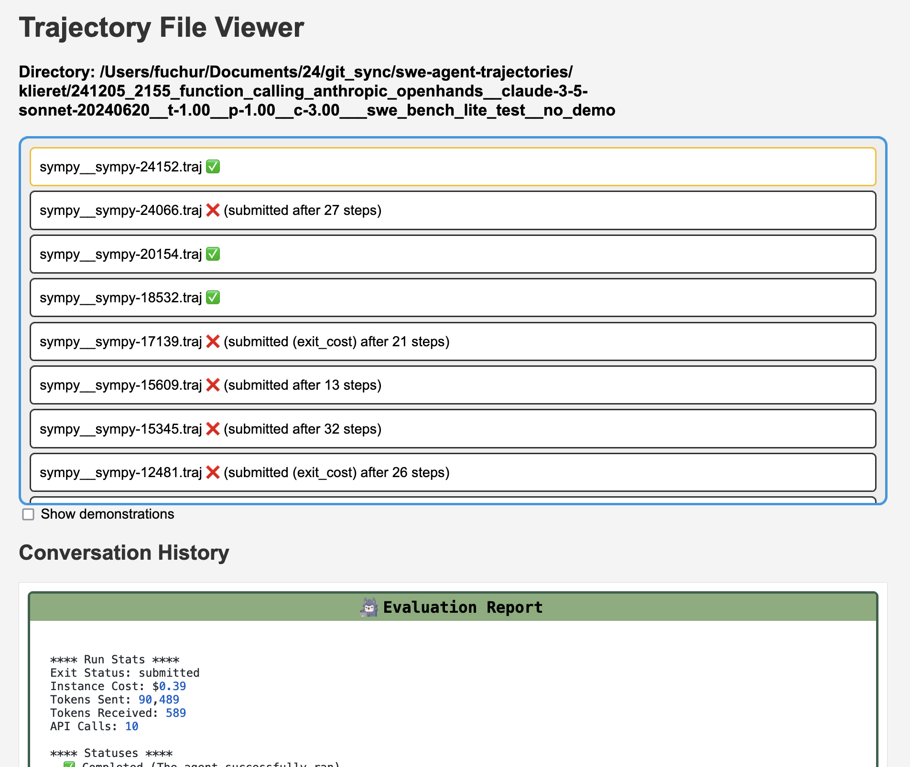
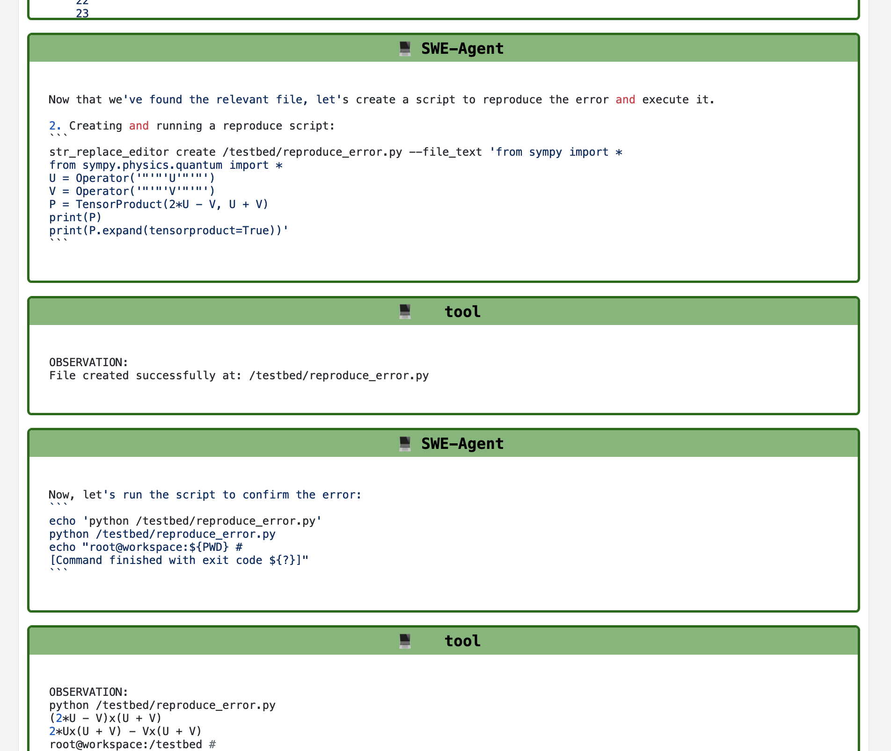

# Inspecting trajectories

!!! abstract "Inspecting trajectories"
    * Trajectories are the main output of Code-Fixer. They are the best way to understand what Code-Fixer does, especially when running on many problem instances.
    * We provide two tools for visualizing the [`.traj` files](trajectories.md) from the `trajectories` folder more easily.
    * Use `code-fixer inspect` (or `codefixer i`) to open the command line inspector.
    * Use `code-fixer inspector` (or `codefixer I`) to open the web inspector.
    * Please complete the [hello world](hello_world.md) tutorial before proceeding.

You should see a folder called `trajectories` in your working directory. Let's go to one of the *experiment directories*:

```bash
cd trajectories/$USER/<some directory>  # (1)!
```

1. Don't have a folder here? Make sure to run Code-Fixer at least once.

## Command line inspector


Run the inspector in the directory containing your `.traj` files:

```bash
codefixer inspect
# or
codefixer i
```

You will be put into a pager that lets you navigate between trajectories.
Here's how to navigate (this is similar to vim keybindings):

* Use `q` to quit
* Switching between trajectories:
    * `H` and `L` go to the previous/next trajectory
    * `t` brings up a list of all trajectories. Use type-ahead search to find a specific trajectory (once your search string results in a single match, the trajectory will be opened). Press `<TAB>` to cycle through the list of matches.
* Use `h` and `l` to navigate between the steps in the trajectory
* Use `j` and `k` to scroll down/up
* By default we only show reduced information. You can press `v` to toggle the view.
* Press `o` to open the logs
* Sometimes you see that you can press `e` to open a file in your `$EDITOR`. For this to work, the `EDITOR` environment variable must be set (e.g., to `nano` or `vim`).

## Web-based inspector


Run the inspector in this directory (this is where your `*.traj` files are):

```bash
codefixer inspector
# or
codefixer I
```
The inspector will then be launched in the browser:

{: style="width: 49%;"}
{: style="width: 49%;"}

**Additional flags**

- `--directory`: Directory of trajectories to inspect (Defaults to current directory)
- `--port`: Port to host web app (Defaults to `8000`).

## Benchmark results

If you are running Code-Fixer on a benchmark (see [batch mode](batch_mode.md)), you will see evaluation results as ✅ or ❌.
Otherwise, you will see ❓.

!!! tip
    * If you do not see evaluation results, make sure that the SWE-bench output
      is called `results.json` and is in the same directory as the trajectories.
    * To see gold patches, point `--data_path` to the SWE-bench dataset.



